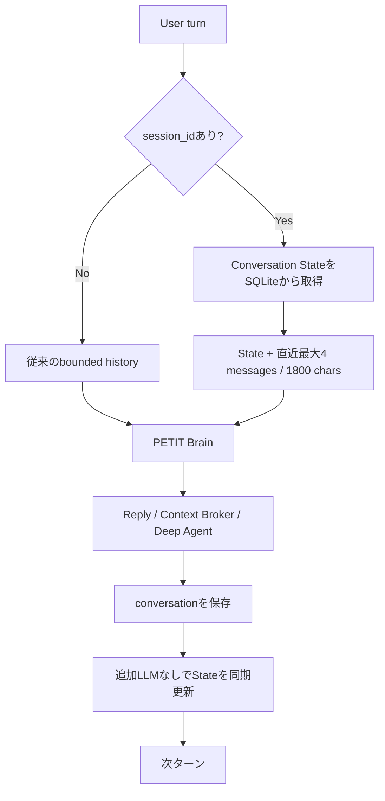

# Conversation State

Issue #244で導入する、同一セッション内の圧縮会話状態です。

## 目的

毎ターン長い会話履歴をLLMへ送り続けず、「今の話題」「目的」「最近の決定」「未解決事項」「active project」「最近参照した対象」だけを小さく保持します。

Conversation Stateは長期Memoryの正本ではありません。壊れても通常履歴へfallbackできる最適化レイヤーです。

## Runtime

## 保存項目

- `current_topic`
- `user_goal`
- `recent_decisions`
- `unresolved_items`
- `active_project`
- `active_task`
- `recent_entities`
- `last_user_text`
- `last_assistant_text`
- `confidence`
- `updated_at`

## Budget

Stateが存在するセッションではBrainへ渡す通常履歴を最大4 message / 1800 charsへ縮小します。State自身はモデル向けrender時に最大1600 charsへ制限します。

Stateが存在しない場合は既存Agent Runtimeの履歴budgetへfallbackします。

## 更新方針

State更新のための追加LLM Callは行いません。会話保存後に決定論的な軽量更新を行います。

- 「その続き」「あれ」「さっき」等は前のtopic/goalを維持
- 「〜にする」「採用」「導入」等はrecent decision候補へ追加
- 「未確認」「失敗」「不明」等はunresolved候補へ追加
- active projectは既存Project Continuityの状態を参照
- 引用語や識別子はrecent entities候補へ追加

これらは会話理解を補助するヒントであり、長期MemoryやProject台帳を書き換える正本ではありません。

## Safety / Fallback

- `session_id`がない場合はState無効
- State読取がなくても会話可能
- State更新失敗はChat成功を失敗扱いにしない
- Write confirmation / Project Continuity / Tool safetyは変更しない
- 長期文脈が必要な場合は将来のMemory Context Brokerへ委譲する

## Observability

`model_route` / Chat observabilityへ以下を追加します。

- `conversation_state_chars`
- `history_chars`
- `history_messages`

これによりConversation State導入前後の入力context量を比較できます。
