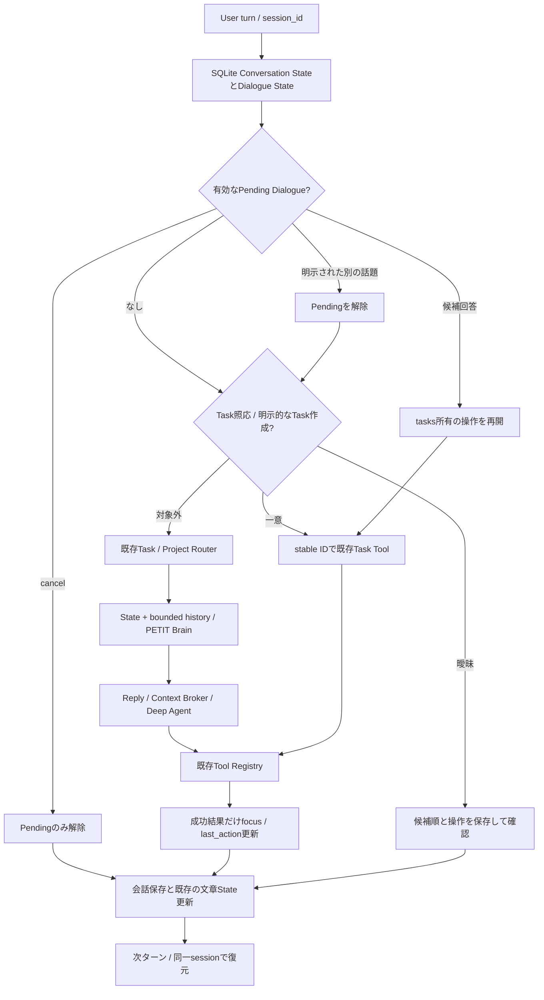

# Conversation State

Issue #244の圧縮会話状態に、Issue #294のDialogue Working Memoryを追加します。

## 目的

毎ターン長い会話履歴をLLMへ送り続けず、「今の話題」「目的」「最近の決定」「未解決事項」「active project」「最近参照した対象」だけを小さく保持します。

Conversation Stateは長期Memoryの正本ではありません。壊れても通常履歴へfallbackできる最適化レイヤーです。

## Runtime

```mermaid
flowchart TD
    U[User turn / session_id] --> L[SQLite Conversation StateとDialogue State]
    L --> P{有効なPending Dialogue?}
    P -->|候補回答| OWN[tasks所有の操作を再開]
    P -->|cancel| CANCEL[Pendingのみ解除]
    CANCEL --> SAVE
    P -->|明示された別の話題| CLEAR[Pendingを解除]
    P -->|なし| F{Task照応 / 明示的なTask作成?}
    CLEAR --> F
    F -->|曖昧| ASK[候補順と操作を保存して確認]
    F -->|一意| T[stable IDで既存Task Tool]
    F -->|対象外| R[既存Task / Project Router]
    OWN --> T
    R --> B[State + bounded history / PETIT Brain]
    B --> A[Reply / Context Broker / Deep Agent]
    A --> TOOL[既存Tool Registry]
    T --> TOOL
    TOOL --> OBS[成功結果だけfocus / last_action更新]
    OBS --> SAVE[会話保存と既存の文章State更新]
    ASK --> SAVE
    SAVE --> NEXT[次ターン / 同一sessionで復元]
```

## 保存項目

- `current_topic`
- `user_goal`
- `recent_decisions`
- `unresolved_items`
- `active_project`
- `active_task`
- `recent_entities`
- `last_user_text`
- `last_assistant_text`
- `confidence`
- `updated_at`

## Budget

Stateが存在するセッションではBrainへ渡す通常履歴を最大4 message / 1800 charsへ縮小します。State自身はモデル向けrender時に最大1600 charsへ制限します。

Stateが存在しない場合は既存Agent Runtimeの履歴budgetへfallbackします。

## 更新方針

State更新のための追加LLM Callは行いません。会話保存後に決定論的な軽量更新を行います。

- 「その続き」「あれ」「さっき」等は前のtopic/goalを維持
- 「〜にする」「採用」「導入」等はrecent decision候補へ追加
- 「未確認」「失敗」「不明」等はunresolved候補へ追加
- active projectは既存Project Continuityの状態を参照
- 引用語や識別子はrecent entities候補へ追加

これらは会話理解を補助するヒントであり、長期MemoryやProject台帳を書き換える正本ではありません。

## Safety / Fallback

- `session_id`がない場合はState無効
- State読取がなくても会話可能
- State更新失敗はChat成功を失敗扱いにしない
- Write confirmation / Project Continuity / Tool safetyは変更しない
- 長期文脈が必要な場合は将来のMemory Context Brokerへ委譲する

## Observability

`model_route` / Chat observabilityへ以下を追加します。

- `conversation_state_chars`
- `history_chars`
- `history_messages`

これによりConversation State導入前後の入力context量を比較できます。

## Dialogue Working Memory (#294)

`conversation_state`に`focus_stack`、`last_action`、`pending_dialogue`のJSON列を追加移行します。既存行・圧縮状態・Frontendの`history`契約を維持します。

- focus: `entity_type=task`、SQLite内部の安定した`entity_id`、`title`、`source`、`role`、`turn_id`、UTC `updated_at`。最大8件、24時間以内。名称の再検索で別IDに置換しません。
- roles: `last_created` / `last_updated` / `last_completed` / `last_selected` / `parent` / `child` / `mentioned`。親子変更ではchildが主focus、parentは関連focusです。
- last action: Tool名・対象ID・turn・UTC更新時刻。外部同期完了を表すものではありません。
- pending: tasks所有の操作、元の依頼、不足slot、表示順の候補、作成時刻、消費用ID。TTLは10分。再起動後も同じsessionで復元し、期限切れは読み取り時に無効にします。
- Tool Registryの共通hookが成功した`create_task` / `update_task` / `complete_task` / `set_task_parent`を観測。エラー、partial update、一覧Readは成功focusに昇格しません。既存確認APIも作成時sessionを束縛して実行します。

優先順は、Pending Dialogueの回答・取消 → focus照応 → 明示Task → 既存Task完了 / Project Continuity → BrainのCapability選択 → Broker / Deep Agentです。承認操作は既存確認APIが所有し、Dialogue回答では承認を代替しません。

候補名・ID・前者/後者・番号・「やっぱりA」を決定論的に解決します。「それ」は候補が1件の時だけ。複数の候補は表示した順を保持し、削除済みIDを選んでも別タスクへ置換しません。Pendingは操作前に一度だけ消費します。別の明示Task/Project依頼や「ところで」等の話題転換は古い確認を解除します。

Task照応は「その/それ/これ/こいつ/さっきの/前の」の子作成、期限（日付・今日・明日・明後日）、名前変更、完了に対応します。前者/後者・番号は候補確認を経て解決し、暗黙のstack順を番号扱いしません。同一turnの複数Task操作は曖昧として確認し、別turnの一意な直前成功結果は直接使います。未対応のTask照応は確認に戻し、LLMによる別対象への書き込みへ流しません。focusがない場合の確認回答は、明示された名前/IDをSQLiteで完全一致検索します。長期Memory/BRAIN/外部一覧は検索しません。

`ゲーム開発` / `Web開発` / `AI開発` / `アプリ開発`はProject actionにしません。`PETIT開発する` / `PETITの開発を進める` / `PETITやる` / `PETITに戻る` / `PETITの続きやる`は従来のProject処理です。

### Safety / 制約

- `low_risk_write`の既存Task Toolだけを明示操作として呼び出し、確認対象にriskが変われば即時実行を拒否します。
- Life → 親 → 子の2段制約とNotion同期済み親の制約を再利用。無効な親は子を作る前に拒否します。作成後の親子設定失敗は、作成済みと設定失敗を分けて伝えます。
- Notion未同期の親には子を作れません。親が同期済みになった後で依頼を再送してください。外部同期の成功はSQLite保存の成功と区別します。
- sessionなしでは新しい照応処理を無効化。状態更新・読み取り失敗はログへ記録し、Toolの成功結果や通常チャットを失敗にしません。
- 並行した異なる依頼を同一sessionへ送る順序保証は、既存のチャットAPIと同じです。確認回答の二重消費だけをSQLiteの原子的更新で防ぎます。

### Backend threadの正本へ寄せる設計

4層の責務を保ちます: Turn History（発話/Tool呼出し/結果） → Dialogue Working Memory（focus/確認/目的/active Task・Project） → Episodic Memory（要約・日次ログ） → Knowledge / Sources（BRAIN・Notion・GitHub・Calendar・Linkraft）。

今回の正本はBackendのsession別SQLite Dialogue Stateです。Frontendの`history`は互換入力であり、実体参照の正本ではありません。将来は`message + session_id`を基本入力として、Backendが発話・Tool呼出し/結果・承認receiptをthreadのeventとして保持し、そこからbounded historyを組み立てる方向です。現段階では既存conversations、Agent state、承認receiptを一気に統合せず、Frontend historyを省略したTask照応を既に利用できます。

### 検証

`tests.test_dialogue_state`、`tests.test_dialogue_resolution`、`tests.test_project_router_context_guard`でAcceptance Criteria 1〜9と安全回帰をLLMなしで検証します。`model_route`およびChat observabilityの`dialogue_state_used` / `dialogue_resolution_source`で、pending、成功Tool、選択、曖昧、stale等の解決元を確認できます。

受入手順: 同じブラウザsessionで「ゲーム開発タスク追加」「その子にWEVORA追加」を送信し、返答と親タスクのCHILD TASKSを確認。サーバー再起動後に「その期限明日にして」を送信し、同じWEVORAのIDが更新されることを確認します。
