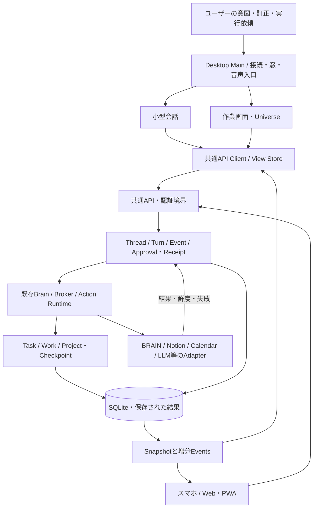
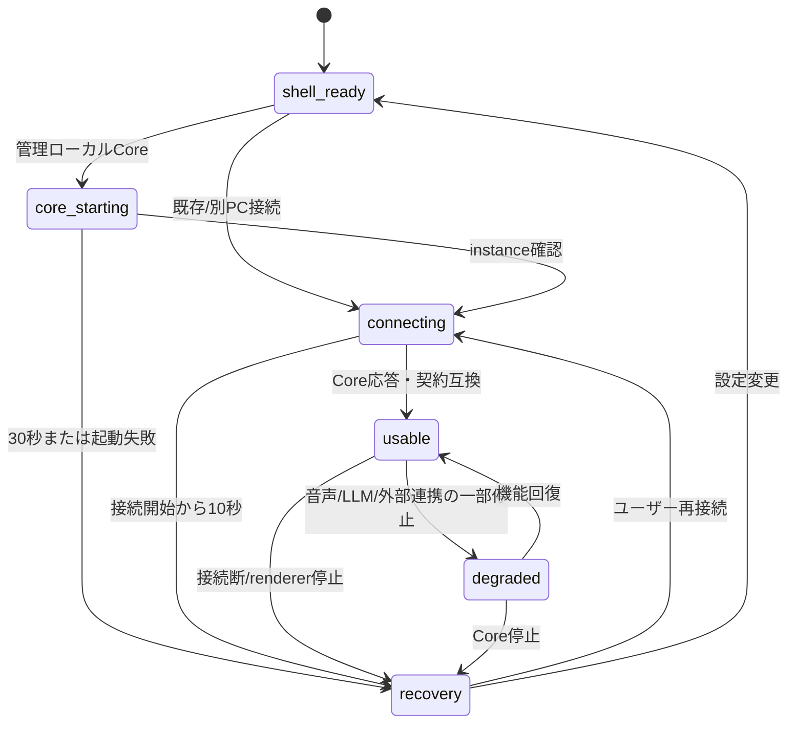

# PETIT Desktop・共通Core 基盤設計

決定日: 2026-10-07 UTC。設計Issue: [#301](https://github.com/Soso2e/PETIT/issues/301)。
状態: **目標設計。以下の新API・永続化・Core管理は未実装**。現行はv0.25.0の実装と `runtime-flows.md` を正とする。

## 1. 目的と設計の優先関係

PETIT_AS_JARVISの目的は、生活・制作・開発の背景を毎回説明せず、相談から次の行動、作業、結果確認、中断と再開まで進めること。DesktopをPCの主入口とし、スマホ/PWAも同じCoreを使う。音声、空間UI、先回りはこの一周を支える。

| 文書 | 所有する判断 |
| --- | --- |
| `Concept.md` | 誰を支援し、何を解決するか |
| `ASSISTANT_ARCHITECTURE.md` / `terminology.md` | 情報源の正本、Project/Task/List/Memory/Handoffの意味 |
| 本文書 | Desktopの入口、共有状態、起動/復旧、移行順、完成条件の新しい目標 |
| `modular_architecture.md` | Core/Module/Integration/Clientの依存方向 |
| `jarvis-agent.md` / `jarvis-workspace-agent.md` | Brain/Broker、状況支援、任意PC観測の方針 |
| `runtime-flows.md` / `PROGRESS.md` | 実装済みの処理と現在地 |

過去の「Webが製品の中心」はPCの入口について本文書で更新する。Coreの共有、BRAIN/Notionの役割、既存risk/承認は維持する。目標図を現行Runtime図に混ぜない。BRAINの2026-08-03ノートは当時案として参照し、現行Conceptと実装を優先する。

### 現状を確認して分かった構造的な不足

- 2つの会話UIが独立したhistoryを持ち、復元と新しい送信が競合する。sessionの自動分割もClient側にある。
- `/api/chat`は実行終了まで待ち、通常会話の保存は処理後。`request_id`付きTurnの受付/実行/結果を耐久的に照会する契約がない。
- 通常の承認待ちは `pending_actions.py` のプロセスメモリにあり、再起動で失う。Sona Core経路は別adapterとして扱う。
- Jobsのdelivery ACKはsession単位。複数画面が同じprogressを独立して読むためのcursorではない。
- 小型会話に追加した下書き/待機/非表示制御が、作業画面のChatまで共通化されていない。
- Mainのready監視はページ読み込み後に開始する。Core起動、接続、画面起動の期限が独立していない。
- 既存Module Registryは利用できる。UI変更だけでは、上の永続性と所有権を揃えられない。

## 2. 毎日の一周と画面の責務

基本の一周を **呼び出す → 状況を掴む → 今やる1個 → 開始/再開 → 実行結果を確認 → 中断地点を残す** に固定する。

| 入口 | 責務と表示 | 所有しないもの |
| --- | --- | --- |
| 小型会話 | 素早い相談/音声。同じthreadの直近会話、処理中/確認待ち、次の一手。作業画面への移動 | 独自history、独自の承認状態 |
| 作業画面 | 現在のTask/Project、次の一手、期限、作業開始/停止、成果と未確認を表示。会話を継続 | 別の人格/会話threadを自動生成しない |
| Universe | 同じTask/Project状態を空間で見渡し、選択する。作業中Taskと選択Taskを区別 | 選択を開始/完了に変換しない |
| 接続・復旧 | 同梱画面。接続先、使える機能、再接続、結果照会、設定への導線 | 推測による成功、自動再送 |
| 設定 | 接続/音声/表示/通知/更新のカテゴリ。通常項目を先に、高度なmodel/pathを後に置く | APIキーを会話履歴やRendererへ渡さない |

主要ナビは既存の3領域を使う: **今（Universe/現在の作業）、やること（Tasks）、相談（PETIT）**。予定・通知・記憶検索・設定はutilityとして到達可能にする。Home/Focus/Todayを新たな並列タブとして増やさない。

既定の「今」は、作業中の対象と再開地点を最初に表示する。作業なしなら次の候補を表示し、情報が取れない場合を空一覧と区別する。Universeは同じ状態の表示モードとして保持し、文字による一覧・キーボード操作も提供する。色/余白の変更より先に、各状態の表示と次の操作を揃える。

小型会話と作業画面の切替ではthread、入力下書き、確認待ち、実行結果を引き継ぐ。同じthreadで同時に別々の文章を編集中の場合は上書きせず、各viewの下書きを保持し「別の画面の下書き」を選べるようにする。文字会話の保護を先に共通化し、その後音声を同じTurnへ接続する。

## 3. システムと状態の所有権

技術はElectron、FastAPI、SQLite、Vanilla JS、既存Module Registryを維持する。Tauri/Reactへの移行、Redis/Kafka、新しい汎用Agent基盤はこの計画に含めない。

これは目標の依存図。全機能をevent sourcingへ作り直さず、既存Domain表を残し、その変更と実行の証拠を追跡する。

| 状態 | 正本 | Clientで保持するもの |
| --- | --- | --- |
| Task/Project/作業時間 | 既存Domainと情報源の契約。Notion連携Taskはsource IDと同期状態を維持 | 最後に読んだsnapshotとrevision |
| 会話・Tool結果・処理状態 | Coreのthread/turn/events。長期Memoryと分離 | 表示用投影、読取cursor |
| Dialogue focus/照応 | 既存session別Dialogue State。threadとの対応を固定 | 選択表示。正本を推測で書き換えない |
| 承認待ち/決定/書込結果 | Coreの永続Approval/Receipt | 対象と変更のpreview、状態 |
| 下書き/窓/表示テーマ | 端末。Core/thread/view別、revision付き | Desktop MainのuserDataへ保存。送信成功で対応するrevisionだけ消す |
| 記憶/外部の知識 | BRAIN/Notion等、既存Architectureの役割どおり | 必要部分のcache。記憶候補を現在の事実に昇格しない |
| 音声デバイス/再生 | DesktopのAudio Session。1端末1所有者 | 同じTurnの録音/STT/再生状態 |

Taskのローカル保存、外部同期、AIの返答生成は別の結果として表示する。AIが後段で失敗しても、保存済みTaskを失敗/未実行と偽装しない。Chromaは再構築可能な索引で、起動や会話受付の必須条件にしない。

### 会話と実行の目標契約

- **Thread**: 続ける会話の安定ID。小型/作業画面は同じものを読む。「新しい会話」の明示操作で作成し、2時間のidleで勝手に分割しない。
- **Turn**: 受け付けた1依頼。client生成UUID `request_id`、thread、入力、状態、開始/終了時刻、効果のreceiptを持つ。
- **Event**: thread内で単調増加する `seq`、`type`、`request_id`、UTC時刻、payload。会話表示と進捗は型を分け、進捗はモデルhistoryへ混ぜない。
- **Approval**: 元Turn/thread、正確な対象/引数、期限、preview版、決定、消費状態を永続化。TTLは既存10分を維持する。二重承認は同じ結果を返す。
- **Effect receipt**: Tool試行と保存先の結果。状態は `not_started / applied / partial / unknown`。外部同期状態を別fieldで示す。外部APIのexactly-onceは保証しない。
- **Client/view**: `client_id`は端末、`view_id`は画面。最後に開いたthreadは端末設定として保存する。別端末は同じthreadを明示して再開でき、全会話を自動合流しない。

管理Coreのportは再起動で変わり得るため、Desktop下書きをRendererのorigin別localStorageだけに依存させない。Mainの限定IPCから `core_id / thread_id / draft_id / revision` で原子的に保存する。core_idはdata directoryに紐付く安定ID、instance IDは起動ごとのID。窓移動では同じdraftを引き継ぎ、同時編集が分岐したら別draftを保持する。Web/PWAはそのoriginの端末保存を維持し、別originや別Coreへ下書き/承認を自動送信しない。

Turnは `accepted → running → awaiting_confirmation / completed / failed / interrupted`。承認後は既存Runtimeの状態再開へ接続する。再起動時の未完了Turnは `interrupted` にし、書込結果をreceiptから照会する。実行開始済みなのに結果の証拠がない場合は `unknown`。受け付け済みという理由だけでWriteを再実行しない。

同じ `request_id` を再送した場合、同一thread/入力なら保存済みTurnを返し、異なるthread/入力なら409。新しいrequest_idでの再送は新しい意図なので、自動で行わない。1threadの実行は1件に直列化する。別画面から新規送信が競合したら429と現在のTurn IDを返し、下書きを保つ。実行中の無制限queueは作らない。確認待ちは実行枠を解放し、確認APIも同じthreadの実行境界で処理する。

「待機をやめる」は画面側の待機終了。「処理を止める」はCoreへの取消要求。取消要求は次の安全な境界で止め、実行中の外部I/Oを取り消したと断言しない。効果の結果は停止後もreceiptへ記録する。新しいToolは取消要求後に開始しない。

### 追加する最小API（未実装）

| API | 契約 |
| --- | --- |
| `GET /api/runtime/status` | 安定core_id、instance/API契約版、feature別 ready/degraded/unavailable、最後の診断時刻。保存済みstatusのみ返し、GETでLLM/外部syncを起動しない |
| `POST /api/threads` | 新threadを作成。既存sessionを移行する場合は明示した旧sessionとの1対1対応を保存 |
| `GET /api/threads` | 最近のthreadと現在の未解決Turnをboundedに返す。既定20件、cursorでページング |
| `GET /api/threads/{id}/snapshot` | 会話・確認待ち・Turn結果と `last_seq` を同一SQLite読取transactionで返す。会話は直近50eventから取得 |
| `GET /api/threads/{id}/events?after_seq=N` | 最大100件をseq順に返す。複数画面の読取cursorは独立。読取でdelivery済みにしない |
| `POST /api/threads/{id}/turns` | `{request_id, message, conversation_mode}`。受付と入力eventを原子的に保存して202。実行は既存Runtime adapterへ。重複は既存結果を200で返す |
| `GET /api/turns/{request_id}` | 状態・reply・pending actions・効果receipt・未確認を照会。HTTP切断後も利用可能 |
| `POST /api/turns/{request_id}/cancel` | 取消要求を保存。取消完了・副作用取消しと同一視しない |

既存 `/api/actions/{approval_id}`、`/api/chat`、`/api/conversations`、`/api/jobs*` は維持。新ClientはTurn APIへ移行し、旧Clientは同期レスポンスのadapterを継続する。旧historyは旧経路の互換入力として受け、新TurnのhistoryはCoreが保存eventからboundedに組み立てる。thread所有権はIDの知識だけで決めず、現在の認証/接続主体の範囲で検証する。

初回はsnapshot、その `last_seq` から増分を適用する。取得中に新しい送信があってもsnapshotで新しい状態や下書きを上書きしない。適用済みseqは重複排除する。無効cursorは409を返しsnapshotを再取得する。

配信は最初にHTTP増分取得へ統一する。実行中は2秒、表示中idleは15秒、全画面非表示では休止、再表示は即時取得。実行自体はCoreで継続する。新eventに既存Jobsの「session全体ACK」を流用しない。SSE/WebSocketは初版の必須条件にしない。

## 4. 起動・障害・配布

### DesktopのCore接続モード

目標の既定は **管理するローカルCore**。別PCのCoreへ接続するモードも残す。v0.25.0からの移行中は既存接続先を維持し、未完成の自動起動へ切り替えない。

- Mainは窓、接続、Core子プロセスの所有権だけを持つ。BrainやDomainをMainへ移植しない。
- ローカルCoreは配布したPython runtime/依存を用い、loopbackの空きportで独立プロセスとして起動。LM Studio/STT/TTS本体は同梱・自動起動の前提にしない。
- Mainと子の起動channelでinstance ID/portを照合し、そのinstance専用tokenで接続する。任意のportにある別サービスをPETITとして採用しない。
- tokenはMainが保持し、許可されたCore originへの通信にだけ付ける。STTや外部URLへ付けない。環境変数やログの全文、トークンをRenderer/LLMへ渡さない。
- 同一data directoryはCore単一起動。既存Coreの再利用はinstanceと契約版を検証できる場合だけ。別PCモードのサーバーや所有していないPIDは終了しない。
- 終了時は所有Coreへ取消/新規受付停止を要求し、最大30秒の終了待機を表示する。期限超過で所有子だけを停止し、次回起動で未完了結果を照会する。窓を閉じる操作は常駐を維持し、remote Coreは停止しない。
- データはインストール先から分離してuserData/Coreへ。既存storageは明示importでSQLite backupとpath検証を行い、元データを残す。BRAIN/外部provider設定を無断コピーしない。

### 状態と期限

Shellは最初に表示し、文字入力/下書き保存は外部サービスreadyを待たない。Core起動30秒、接続開始10秒、画面作成から8秒の期限をそれぞれ持ち、ページ読み込み後から計測しない。互換性不一致は再接続の無限loopにせず更新/接続設定へ案内する。

LLM停止でも保存済みTask・作業・履歴を閲覧する。STT停止でも文字入力を使う。外部同期停止はローカル保存と区別する。Core停止中にClientが新規Writeをqueueして自動送信することはしない。

短い再接続は1/2/4秒で最大3回、読取/接続だけに行う。その後は復旧画面の手動再接続。Core自動再起動も3回までで止める。復帰後は未解決request_idの結果を照会し、文字・承認・Writeを再送しない。スリープ/ロックでは音声停止、復帰時はinstance/結果照会から再開する。

### 音声・通知・更新

- 音声は同じTurn APIを使う。1端末1 Audio SessionをMainが調停し、窓切替でマイクを二重取得しない。準備/録音/STT/思考/再生/終了を同じ状態語で表示する。
- 初版は既存の半二重方式。連続会話はopt-in。先頭音声引継ぎと自然な割込みは実声評価後に追加。復元した返答を自動で読み上げない。
- 通知はCoreが根拠・期限・対象更新版で重複判定し、端末側は集中/quiet timeに従い提示する。通知から対象Turn/Taskを開く。通知の既読と会話eventの読取cursorを混ぜない。
- アプリと管理Coreを同じbundleの契約版で配布し、別PCCoreにはsupported API版の互換範囲を表示。未署名版は開発用。署名/公証と更新は #261 の既存計画へ接続する。
- DB変更前はSQLite backup。binary rollbackはschema互換時のみ。自動で古いDBを戻して更新後の会話やTaskを消さない。非互換なら復旧画面で停止する。

## 5. 移行順と段階の完了条件

親Issue #301の下で段階を分け、各PRに新旧互換・受入・Mermaidの現行更新を含める。各段階は関連CI成功後に反映する。実機受入だけが残るものを実装未完了と混同しない。

| 段階 | 変更と依存 | その段階を閉じる条件 |
| --- | --- | --- |
| [A #302](https://github.com/Soso2e/PETIT/issues/302) 起動/読取の境界 | 接続開始からの期限、cached runtime status、両画面で下書き/待機/履歴復元を共通化。新Turn APIを待たない | 読込が完了しないfixtureでも復旧し、遅い履歴と新発言が混ざらず、成功が新しい下書きを消さない |
| [B #303](https://github.com/Soso2e/PETIT/issues/303) 永続Turn/承認/結果 | SQLite thread/turn/events/approval/receipt、新API、既存Runtime adapter。既存Domainは残す | 同一request二重送信・二重承認で二重実行せず、再起動後に結果/確認待ちを照会し、結果不明で自動Writeしない |
| [C #304](https://github.com/Soso2e/PETIT/issues/304) 同じPETITの画面 | Bに依存。共有API Client/View Store、snapshot+cursor、Core history、同じthreadの小型/作業画面 | 片側の発言/確認/結果が他方へ反映され、復元・遅延・順不同取得・両画面の下書き競合を保護する |
| [D #305](https://github.com/Soso2e/PETIT/issues/305) 起動をアプリ内で完結 | A/Bに依存。Windows管理Core、instance/port/token、data import/backup。既存別PC接続は維持 | サーバー手動起動なしで文字/保存済み情報を利用でき、他プロセスを終了せず、更新・再起動でデータを保持する |
| [E #306](https://github.com/Soso2e/PETIT/issues/306) 行動の一周と音声 | Cに依存。「今」の情報階層、次の一手、作業/成果、統一設定、音声所有権/通知復帰 | 相談→1件選ぶ→開始→中断→翌日再開→結果確認を実データで一周。合成音声と実声の検証を区別 |
| [F #307](https://github.com/Soso2e/PETIT/issues/307) 配布・実機受入 | D/Eに依存。署名/更新、macOS管理Core/権限、DPI/複数monitor/8時間常駐 | docs/desktop-readiness.mdの実機項目を両OSで通過し、更新前後のデータ保持を確認 |

Bは受付ledger→永続承認→Runtime/Tool receipt→再起動照会の順に縦切りする。ledgerを置いただけで全Writeの重複防止を完成扱いしない。既存Toolごとに検証し、ローカルWriteとreceiptを同一transactionにできるところから移す。外部Writeの開始後にreceiptが確定できなければunknownを維持する。

既存sessionと新threadは1対1に対応づけ、既存Dialogue Stateを再利用する。古いconversationsは原文とIDを残し、過去のTool receiptを捏造してbackfillしない。ユーザーによる明示import/選択なしに、別sessionや同名Projectを合流しない。

## 6. 共通の検証・完成判定

自動: 起動無応答/不正互換版、Core/rendererクラッシュ、同時送信/二重承認、実行直前/直後の停止、HTTP切断/再照会、snapshot/event競合、古いresponse、別画面下書き、期限切れ、外部同期partial、データ移行/rollback境界、非表示取得休止をfixtureで確認する。

実機: Windowsから先に、起動/インストール/実サービスの文字会話/作業の一周を検証する。音声はSTT/LLM/TTSを個別診断してから実声を評価する。macOSは署名/権限/スリープを別ゲートで確認する。cold/warm起動時間、入力可能まで、8時間のCPU/RSS/通信量を記録し、合成テストを実利用の証拠にしない。

完成は、各段階のコード/CIと実機の一周・更新・データ保持が揃った時に判定する。LLMや外部サービスが停止しても、何が使え、何が未確認で、次に何をすればよいかが分かることを必須とする。

## 7. 参照

- [Electron process model](https://www.electronjs.org/docs/latest/tutorial/process-model): Main/Renderer/utility processの境界。Python Core管理はこの境界を使ったPETITの目標設計。
- [Python sqlite3 backup](https://docs.python.org/3/library/sqlite3.html#sqlite3.Connection.backup): live DBのbackup API。ファイルコピーだけで稼働中SQLiteのbackup成功としない。
- [FastAPI Background Tasks](https://fastapi.tiangolo.com/tutorial/background-tasks/): response後の処理機構。永続Turn・再起動復旧の保証はPETIT側のledger/workerで実装する。
