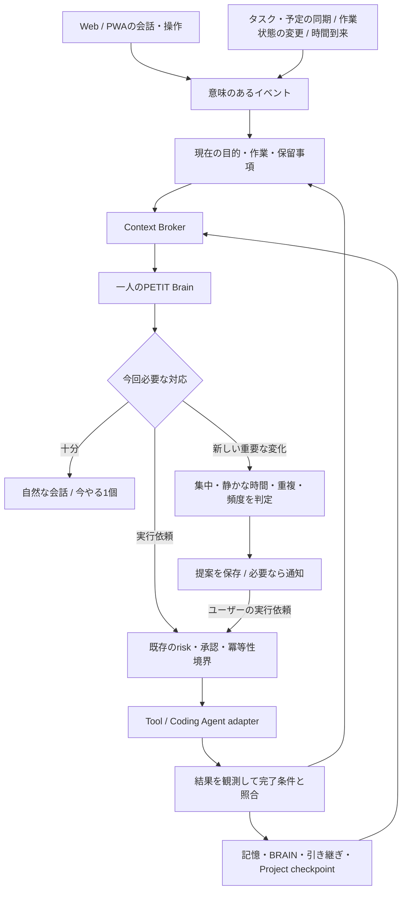

# PETITをWeb中心の常駐パーソナルエージェントへ

関連Issue: #249（今回）、#235、#244、#245、#246、#224、#225。

## 製品の中心

PETITは、Webアプリから利用できる、ユーザーの目的・状況・記憶を継続して支える個人用エージェントとする。
ユーザーが毎回背景を説明し直さずに、相談、次の一手、作業の実行、結果確認まで進めることを目指す。
PC操作や前面アプリの把握は任意の情報源であり、利用の前提にしない。

「常駐」とは、Web画面を開き続けることではなく、サーバーが状態と未完了の目的を保持し、
必要なイベントで動き、次に開いたときにも続きを理解できること。
画面を閉じていてもサーバーで判断できる構造と、閉じた端末へ通知できるかは別問題として扱う。

## 現状の不足と今回の対応

| 不足 | 対応 |
| --- | --- |
| Brokerがタスク・予定のみで、記憶・作業・引き継ぎが分断される | 今回: memory / brain / work / reminders / handoffを追加 |
| 情報取得後の2回目の回答へ、現在の作業文脈が渡らない | 今回: 入口で取得した状況文脈を引き継ぐ |
| provider待ちが会話を長時間止める | 今回: 応答待ちの期限、最大4件の実行中Read、部分結果 |
| 不正なprovider応答が空の成功に見える | 今回: 形式検証、失敗と0件の区別 |
| 生データや長い記憶でContextが膨らむ | 今回: 必要fieldの選別、文字数・件数上限、切詰め表示 |
| 過去の引き継ぎを現在の事実として扱いやすい | 今回: 出典・記録時刻と取得時刻の区別、対象作業名で絞る |
| 常駐処理が要約・同期・個別通知に分かれる | 後続: 共通のイベント・判断・提案状態 |
| 長期間の会話で目的・判断が散らばる | #244のConversation Stateを統合。進行中PR #248と重複実装しない |
| 提案後の実行・成果検証がつながらない | #225 / #246で既存Runtimeへの接続を進める |

## 再設計する処理の流れ

目標設計を示す図。実装済みフローは [runtime-flows.md](runtime-flows.md) を正とする。
既存のFastAPI / Module Registry / SQLite / Brain / Action Runtimeを発展させ、全面置換しない。

## 状況・記憶・判断のデータ契約

- **現在の状況**: 選択中Project、active/paused Work Session、未解決の依頼。期限付きの状態として扱う。
- **観測情報**: タスク・予定・通知・任意PC観測。source、対象ID、取得時刻、更新時刻、stale/errorを持つ。
- **記憶**: ユーザーが教えた事実、過去の判断、引き継ぎ。由来と記録時刻を保持し、現在の事実と区別する。
- **提案**: 根拠、対象、推奨する一手、期限、提示状態を持つ。提案自体をユーザーの意図として保存しない。
- **実行**: 元の依頼、対象、許可範囲、冪等キー、進捗、結果、未確認事項を持つ。

UIで選択しただけのタスクを開始済みと扱わず、「今日はここまで」でタスクを完了にしない。
Notionタスク、PETITリスト、Projectは別の概念として保持する。
記憶は関連するものだけを取得する。全記憶を毎ターン注入しない。
ユーザーの訂正を優先し、矛盾する記録は消したふりをせず、訂正・失効の経路を設ける。

## 先回りの判断

イベント駆動を基本にし、期限到来など時間が必要な場合だけ軽い周期確認を使う。
Webの画面切替やポーリングごとにLLMを呼ばない。

提案するのは、根拠のある状況変化と具体的な次の一手がある場合。
例えば期限接近、作業の再開、未解決blockerの解消、新しい実行結果を扱う。
同じ状態の繰り返し、集中を中断するだけの提案、未同期データからの断定は抑止する。

後続の提案状態は `new → shown → accepted / dismissed / snoozed / expired`。
対象ID・理由・対象の更新版を重複判定キーに使い、サーバー再起動や別タブでも二重通知しない。
通知しない場合も、Webの次回表示で「今やる1個 / 次 / 後で」を復元できるようにする。
一般会話でユーザーの質問を無視して提案を割り込ませない。

## 実行と完了

読み取り・状況整理・提案と、ユーザーデータや外部サービスの変更を分ける。
既存Toolのrisk定義と確認フローを維持する。今回は低リスク書き込みの既存許可を変更しない。
将来、継続的な自動実行を許す場合は、対象・操作・有効期限・回数/費用上限・撤回を持つ許可契約を追加する。
「先回りしてほしい」を個別の送信・削除・購入・任意コマンド実行の許可には変換しない。

成功はToolがエラーを返さなかったことだけでは決めない。
保存先の読み直し、成果物、テスト、CI、必要な実機確認で完了条件を照合する。
失敗や未確認は次の作業として残し、成功した記憶に混ぜない。

## 今回のContext Broker仕様

| source | 取得経路 | 範囲 |
| --- | --- | --- |
| tasks | `get_tasks` | 既存タスク取得、priorityで絞込み |
| calendar | `get_schedule` | date / today / tomorrow |
| memory | `search_memory` | query必須、記憶とepisode。vault検索は別source |
| brain | `search_brain_notes` | query必須、既存BRAINのキーワード検索 |
| work | `get_work_status` | 現在の作業・本日の合計・タスク別時間 |
| reminders | `get_reminders` | 未完了リマインダー |
| handoff | SQLite `handoff_notes` | queryで作業名を部分一致。省略は全作業の直近 |

source名から固定したRead処理へ解決する。Tool経由では実行直前にも `safe_read` を確認する。
1リクエスト最大4 needs。各sourceのfactsは約2500文字、文字列fieldは最大360文字。
日時・source・error・stale・historical・truncatedを残す。未取得と0件を区別する。
記憶の検索結果は候補であり、類似度や部分一致だけで現在の作業へ確定紐付けしない。

`PETIT_CONTEXT_BROKER_TIMEOUT_SECONDS`（既定10秒）はBrokerの待ち時間。
期限内に取れた情報を返し、残りはtimeout。実行中のprovider処理は強制終了できないため、
共有の最大4枠を占有したまま終了を待つ。枠不足では`source_busy`を返し、無制限にキューを積まない。
provider固有のI/O timeoutを置き換えるものではない。応答生成LLMの時間は別途必要。

### 会話例と受け入れ条件

- 「どこから再開する？」: active workと対応するhandoffを参照し、根拠付きで一手を返す。
- 「前に話した制作方針は？」: memory/brainを検索し、記録にないことを補わない。
- 「忘れてない？」: 必要な予定・タスク・reminders等を選び、重要な1〜3件を返す。
- 「それをやって」: 会話内の対象を確定し、既存の実行・承認経路へ渡す。
- providerが停止: 取得できた情報で回答し、不明な範囲を明示する。

自然言語からのsource選択はBrainの判断であり、実モデルの会話品質は別途E2Eで確認する。
今回の自動テストは固定応答・一時DB・模擬providerで契約と経路を検証する。

## 実装順と完成の判定

1. **今回**: Web会話の横断Readと状況継続、時間・サイズ・失敗境界、設計の再整理。
2. **次**: #244のConversation Stateを取り込み、Project checkpointを#245のBrokerへ接続。
3. **次**: #224をイベント駆動の提案として統合。永続的な重複抑止・保留・通知設定を整える。
4. **その後**: #225 / #246で実行と結果検証をつなぐ。失敗から再開できる状態遷移を検証。
5. **任意**: [PC観測](jarvis-workspace-agent.md)、音声、端末Agentを入口・情報源として追加。

評価するのは、背景の再説明回数、誤った事実の断定、提案の採用/却下、不要通知、実行成功・検証率、
LLM Call数・待ち時間。常駐ループや通知があるだけでJARVIS化完了とはしない。

今回は自律的な提案ループ、常時Push、任意作業の自律実行、UI全面刷新までは実装していない。
Web版で動く読み取り基盤を先に安定させ、実際の利用で上の会話例を検証する。
