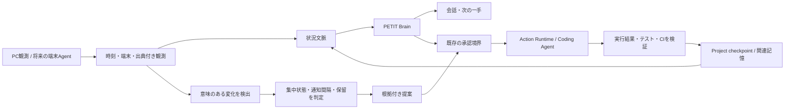

# 任意拡張: PCの作業環境を理解するPETIT

関連: #249 / #235 / #224 / #225 / #244 / #245 / #246

## 到達したい体験

PETITは、ユーザーの目的、過去の判断、今の作業環境を結び、必要なときに次の一手を提案する。
依頼された実行は既存の承認・監査経路へ渡し、結果を検証して次回の支援へつなぐ。
製品の中心はWebアプリであり、PC観測は任意拡張とする。全体設計と優先順は [jarvis-agent.md](jarvis-agent.md) を参照。

例えば「今どこまでやった？」に、観測したブランチ・変更箇所と保存済みcheckpointを分けて答える。
将来は、実際の競合を検出したときに「競合がある。まずこのファイルの差分を確認しよう」と提案し、
「調べて」の依頼で調査し、「修正して」の依頼で承認付き実行へ進む。
変更ファイルが存在するだけで、テスト成功・作業完了・ユーザーの意図は推定しない。

## 現在地と不足

| 領域 | 既存の土台 | 今回・後続 |
| --- | --- | --- |
| 会話 | 共通Core Prompt、Brain、Tasks/Calendar Broker | 今回: PC観測を追加LLMなしでBrainへ注入 |
| 作業 | SQLite Work Session、Project Continuity | 今回: Git作業フォルダと前面アプリを別の観測として取得 |
| 記憶 | 会話、episode、長期記憶、BRAIN、handoff | 後続: workspaceとProjectの明示対応を使い関連記憶だけ取得 |
| 常駐 | 要約、同期、作業check-inのバックグラウンド処理 | 今回: 独立Observer。後続: 端末Agentと意味のある変化の検出 |
| 提案 | 起動時opener、朝briefing、通知基盤 | 後続: 作業中断・競合・期限を根拠に割込みを判断 |
| 実行 | risk、確認、冪等性、監査、Agent再開 | 後続: #225のCoding Agent adapter、結果の照合 |

## 全体設計（後続を含む）



この図は目標設計。実装済みの呼び出し順の正本は [runtime-flows.md](runtime-flows.md)。

### 観測・記憶・推論の区別

- **観測**: 「30秒前、登録リポジトリに未コミット変更が2件あった」。出典と鮮度を持つ。
- **記憶**: 「前回の引き継ぎではUI確認が残っていた」。現状とは限らない。
- **推論**: 「UI確認から再開するとよさそう」。根拠を示し、事実へ昇格させない。
- **意図**: 「この作業を再開する」というユーザーの発話。アプリ名やGit変更だけで決めない。

今の作業セッションを優先し、同名フォルダだけでProjectやNotionタスクへ紐付けない。
端末が違う、観測が古い、接続が切れた場合は「不明」に戻す。
復旧時に過去の提案・実行をまとめて再送しない。

### 実行の契約

| 操作 | 方針 |
| --- | --- |
| 設定済み対象の観測・軽量な状況整理 | バックグラウンドで自動実行 |
| 次の一手・調査候補の提示 | 根拠と未確認事項を短く示す |
| ファイル変更・外部Agent起動・外部データ更新 | 既存Action Runtimeと承認経路を利用 |
| 将来の継続的な実行許可 | 対象、操作、期限、回数・費用上限、撤回を明示した契約を別途実装 |
| 完了判定 | 実行成功、テスト、CI、実機確認を別状態として扱う |

観測されたファイル名・ブランチ名・アプリ名は外部データであり、実行指示として扱わない。
今回のObserverは書き込みTool・Coding Agent・通知を起動しない。

## 今回の実装

`workspace-context` Moduleが独立したdaemon threadで観測する。追加依存はない。

- 最大3つの明示設定されたGitルートを読み、ブランチ、変更項目数、競合数、最大8件のファイル名を返す。
- Gitの変更項目数には未追跡ディレクトリ1項目が含まれ得る。ファイル総数とは限らない。
- Gitルート以外を指定すると失敗扱いにする。親ディレクトリのリポジトリへ探索範囲を広げない。
- Gitは5秒timeout、出力256KB上限。optional lockとfsmonitor hookを無効にする。
- 任意設定でmacOSはbundle ID、Windowsは実行ファイル名だけ取得。Linuxの前面アプリは未対応。
- 前面アプリから実際の編集中ファイル、ブラウザURL、Mayaシーンは取得できない。
- 観測snapshotはプロセスメモリ上のみ。再起動後は新しい観測を待つ。
- `GET /api/workspace-context`はキャッシュを返す。追加のGit/OS取得や状態変更はしない。
- Brainは観測時刻、状態、最大2件/フォルダの短いファイル名を参照する。追加LLM Callはゼロ。
- stale/pendingの場合は具体的な古いアプリ・Git情報をBrainへ渡さない。取得失敗もcleanとして扱わない。
- 収集例外は生のパス・コマンド出力を返さず、`timeout` / `observation_failed`等で示す。

収集対象は **PETITサーバーを動かすPC**。スマホからアクセスしてもスマホや別PCの状態は取得しない。
サーバー停止中・PCスリープ中は観測しない。OSログイン時の自動起動はこの機能には含まれない。

### 設定と有効化

既定は無効。`.env`に次を設定してPETITを再起動する。

```dotenv
PETIT_WORKSPACE_CONTEXT_ENABLED=1
PETIT_WORKSPACE_CONTEXT_DIRS=/absolute/path/to/repository
PETIT_WORKSPACE_CONTEXT_FOREGROUND_ENABLED=0
PETIT_WORKSPACE_CONTEXT_INTERVAL_SECONDS=30
PETIT_WORKSPACE_CONTEXT_MAX_AGE_SECONDS=90
```

複数ディレクトリの区切りはmacOS/Linuxで `:`、Windowsで `;`。
前面アプリも使う場合のみ `PETIT_WORKSPACE_CONTEXT_FOREGROUND_ENABLED=1`。
鮮度の上限は観測間隔より大きくする。全体を停止するにはenabledを `0` にして再起動する。
変更はサンプル設定だけに含め、今回ユーザーの実 `.env` は変更していない。

ファイル本文、画面、ウィンドウタイトル、URL、キー入力は収集しない。
`.env*`、代表的な秘密鍵・認証ディレクトリのファイル名も除外するが、一般のファイル名にも機密情報は含まれ得る。
観測APIは既存PETIT APIと同じ公開範囲になる。会話に使う短い観測情報は設定中のChatモデルへ渡るため、
外部モデル利用時はその送信先にも渡る。観測内容が応答・既存の会話保存に含まれる可能性もある。

### 確認方法

1. 許可したテストrepoでファイルを変更し、APIの`changed_entries`と`files`を確認。
2. 「今のGit作業環境は？」と話し、対象名・ブランチ・変更の有無を答えるか確認。
3. 新しい変更・競合が次の観測で更新されることを確認。
4. repoを一時的に利用不能にし、`unavailable`が「変更なし」にならないことを確認。
5. 前面アプリ取得を有効化した端末でアプリを切り替え、識別子の更新を確認。
6. 無効化して再起動し、APIが`disabled`、会話への注入が空になることを確認。

## PC拡張を進める場合の後続候補

1. **端末の作業対象を明確にする**: workspaceとProjectをユーザーが対応付ける。IDE拡張やMayaプラグインから、許可したファイル・シーン識別子を送る。別PCでは認証・端末ID・TTL付き端末Agentを使う。
2. **関連記憶へ接続**: #245のBroker拡張と#244のConversation Stateを利用し、現在Projectのcheckpoint、直近判断、未確認事項を小さく取得。
3. **先回り提案**: 競合発生、作業再開、期限接近など意味のある変化だけ判定。アプリ切替のたびにLLMを呼ばない。集中状態、静かな時間、同一提案の抑止、保留・却下を保存する。
4. **承認付き実行**: #225のadapterを接続。対象repoと目的を確定し、既存承認・冪等性・進捗配信を利用する。
5. **検証と学習**: 差分・テスト・CIから結果を照合。受け入れた提案だけを嗜好候補として扱い、訂正・削除可能にする。

受け入れ指標は、観測の鮮度、誤った作業対象の断定数、関連記憶の正確さ、不要通知数、
提案の採用/却下、実行成功率、無断実行ゼロ、追加LLM Call数・応答時間とする。
常時大量データを収集することを成功指標にはしない。
