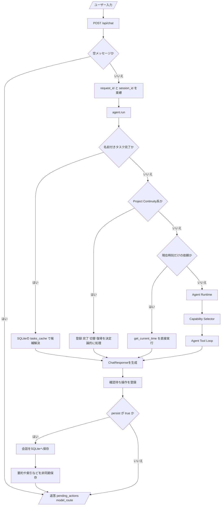
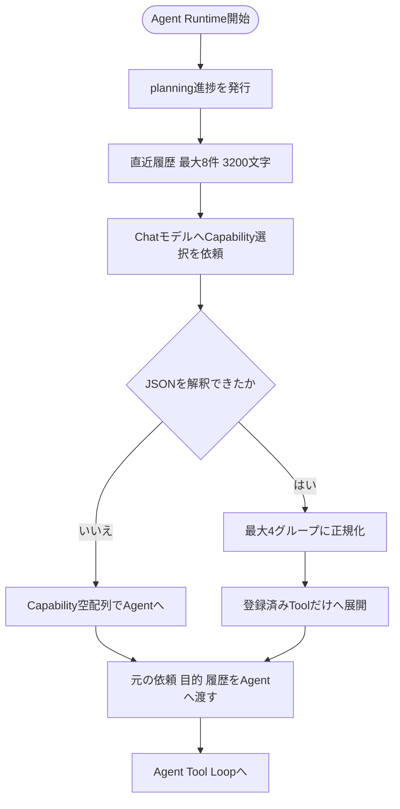
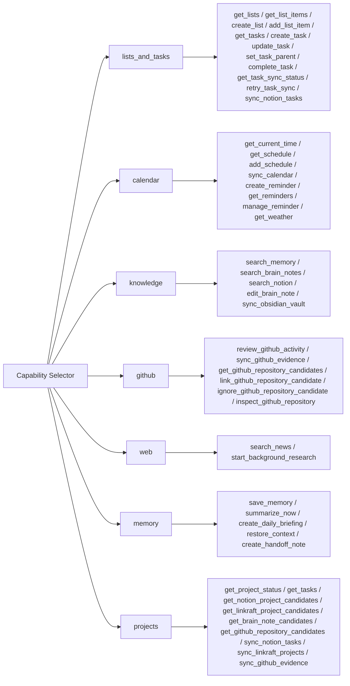
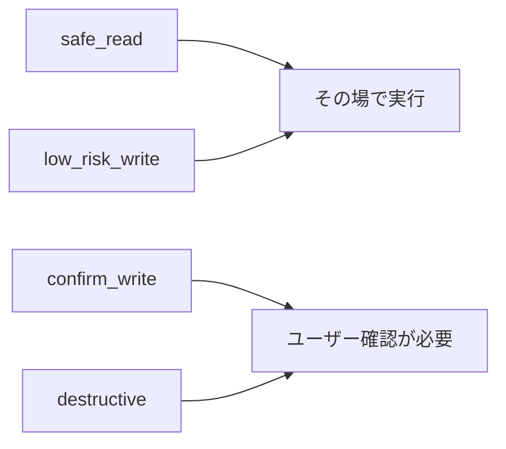
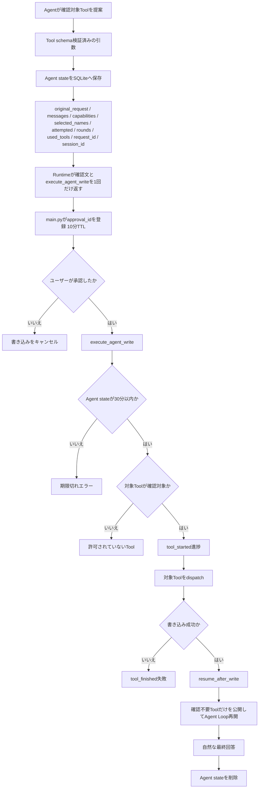
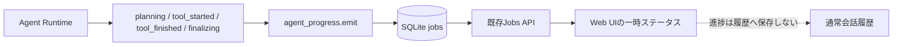
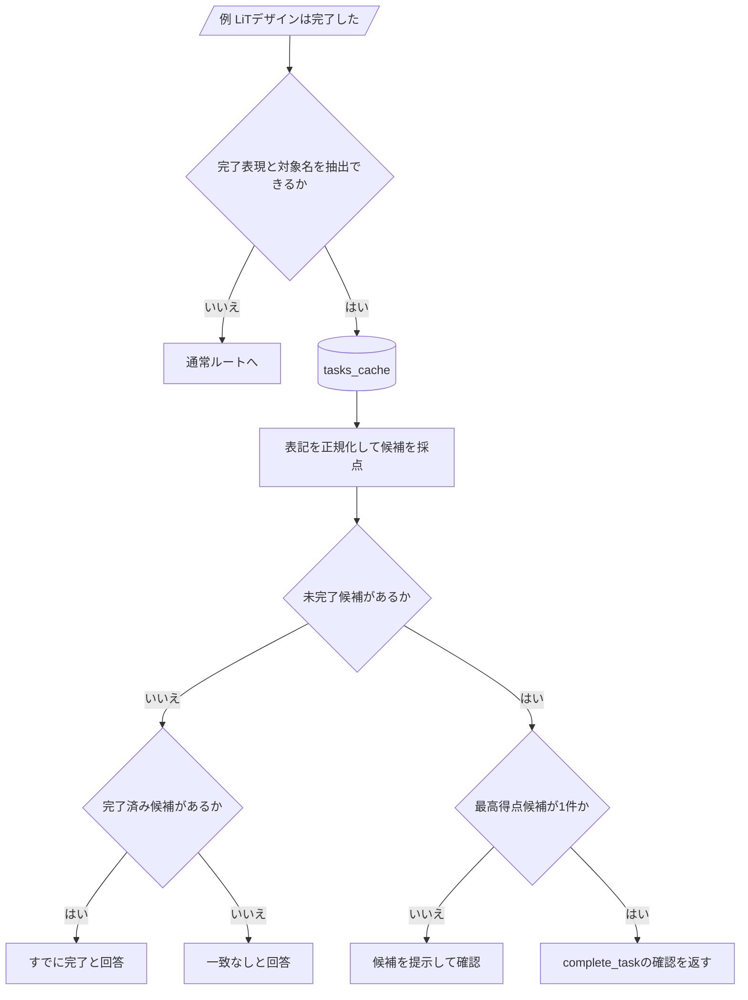
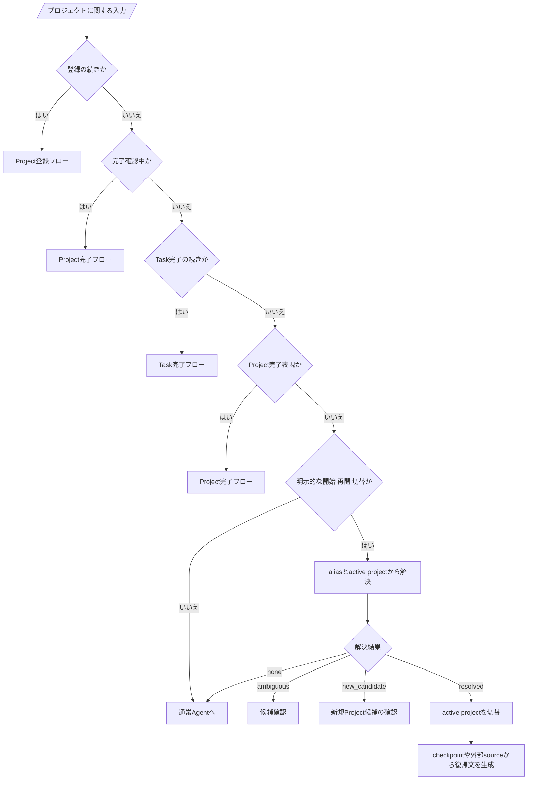
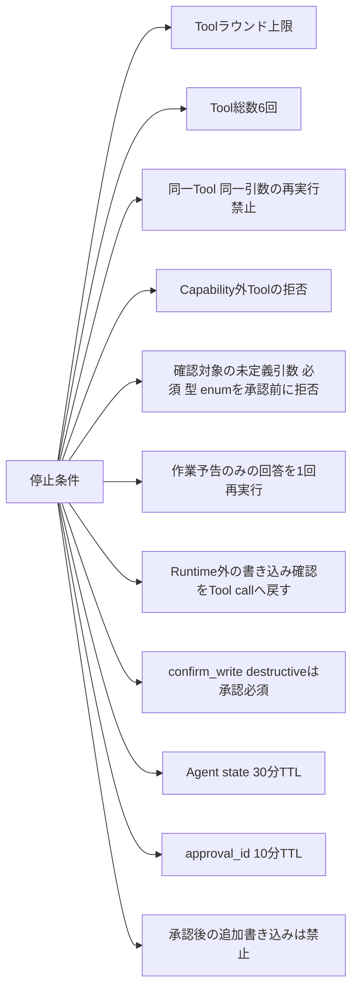

# PETIT Runtime Flows

この文書は、PETITの会話処理・Capability選択・Tool Calling・確認付き書き込み・進捗表示の実装フローをMermaidで可視化したものです。

実装の根拠:

- `backend/main.py`
- `backend/agent.py`
- `backend/agent_runtime.py`
- `backend/capability_router.py`
- `backend/tools/registry.py`
- `backend/tools/agent_actions.py`
- `backend/tools/task_hierarchy.py`
- `backend/agent_state.py`
- `backend/agent_progress.py`
- `backend/project_router.py`
- `backend/task_completion_intent.py`

---

## 1. 会話全体フロー



---

## 2. Capability Selector



### Capabilityと公開Tool



---

## 3. Agent Tool Loop

```mermaid
flowchart TD
    call[Agentモデルを呼ぶ]
    hasCalls{Tool callがあるか}

    answer[回答本文を取得]
    empty{回答が空か}
    fallbackAnswer[言い換えを求める固定文]
    incomplete{作業予告またはRuntime外の確認だけか}
    retryUsed{再実行済みか}
    forceTool[このターンでTool callし Runtime確認へ進むよう再指示]
    deferredFail[未実行を明示した失敗回答]
    finalizing[finalizing進捗を発行]
    final[/最終回答/]

    roundLimit{Toolラウンド上限か}
    stopRound[tool_iteration_limitで停止]
    normalize[Tool callsを正規化]
    each[各Tool callを処理]

    totalLimit{Tool総数6回に到達か}
    stopTotal[tool_call_limitで停止]
    allowed{公開済みToolか}
    notAllowed[tool_not_allowed結果]
    args{JSON解釈と確認対象schema検証に成功したか}
    badArgs[理由付きinvalid_tool_arguments結果]
    duplicate{同じToolと引数を実行済みか}
    duplicateStop[duplicate_tool_call結果]
    confirmation{確認が必要か}
    writeFlow[確認付き書き込みフロー]
    execute[Toolをdispatch]
    progressStart[tool_started進捗]
    progressFinish[tool_finished進捗]
    compact[結果を最大20項目 5000文字へ圧縮]
    append[元の依頼とTool結果をmessagesへ追加]

    call --> hasCalls
    hasCalls -->|いいえ| answer --> empty
    empty -->|はい| fallbackAnswer --> incomplete
    empty -->|いいえ| incomplete
    incomplete -->|いいえ| finalizing --> final
    incomplete -->|はい| retryUsed
    retryUsed -->|いいえ| forceTool --> call
    retryUsed -->|はい| deferredFail --> finalizing

    hasCalls -->|はい| roundLimit
    roundLimit -->|はい| stopRound --> final
    roundLimit -->|いいえ| normalize --> each --> totalLimit
    totalLimit -->|はい| stopTotal --> final
    totalLimit -->|いいえ| allowed
    allowed -->|いいえ| notAllowed --> compact
    allowed -->|はい| args
    args -->|いいえ| badArgs --> compact
    args -->|はい| duplicate
    duplicate -->|はい| duplicateStop --> compact
    duplicate -->|いいえ| confirmation
    confirmation -->|はい| writeFlow
    confirmation -->|いいえ| progressStart --> execute --> progressFinish --> compact
    compact --> append --> call
```

親子関係の変更は`set_task_parent`へ集約する。タスク名の変更も同時に必要な場合は、同じTool callの`title`へ含め、Runtimeの確認を1回だけ表示する。`update_task`へ`parent_id`や`parent_task_id`を渡した場合は、確認画面を出す前に不正引数としてAgentへ返し、正しいToolの再選択を促す。

---

## 4. Tool Registryとリスク判定

```mermaid
flowchart TD
    decorator[@tool decorator]
    riskInput{riskが明示されているか}
    explicit[指定riskを使用]
    override{既定risk一覧にあるか}
    defaultRisk[既定riskを使用]
    legacy{requires_confirmationがtrueか}
    confirm[confirm_write]
    safe[safe_read]
    register[Registryへ登録]

    invoke[AgentがToolを選択]
    parse[引数JSONをdictへ]
    writeRisk{confirm_write または destructiveか}
    schema[properties required type enumを検証]
    valid{schemaに適合するか}
    invalid[[error]またはinvalid_tool_argumentsとしてAgentへ返す]
    dispatch[handlerを実行]
    error{例外や実行時エラーか}
    errorText[[error]文字列を返す]
    result[JSONまたは文字列を返す]

    decorator --> riskInput
    riskInput -->|はい| explicit --> register
    riskInput -->|いいえ| override
    override -->|はい| defaultRisk --> register
    override -->|いいえ| legacy
    legacy -->|はい| confirm --> register
    legacy -->|いいえ| safe --> register

    invoke --> parse --> writeRisk
    writeRisk -->|はい| schema --> valid
    valid -->|いいえ| invalid
    valid -->|はい| dispatch
    writeRisk -->|いいえ| dispatch
    dispatch --> error
    error -->|はい| errorText
    error -->|いいえ| result
```

確認対象Toolでは、未定義引数、必須不足、型不一致、enum外の値を承認前に拒否する。既存Toolが許容している数字文字列IDは、`integer`互換として維持する。

### リスク区分



---

## 5. 確認付き書き込みと再開



Agentが自然文だけで「実行しますか？」と返した場合は承認として扱わず、確認対象Toolをcallするよう1回だけ再指示する。これにより、Agent本文とRuntimeカードの二重・三重確認を防ぐ。

---

## 6. 進捗表示



---

## 7. 名前付きタスク完了の決定論的フロー



---

## 8. Project Continuityの決定論的フロー



---

## 9. チャットで行えることの全体像

```mermaid
flowchart TD
    chat([PETIT Chat])

    tasks[タスクと任意リスト]
    cal[時刻 予定 天気 リマインダー]
    know[BRAIN Notion 記憶検索]
    git[GitHub状況とRepository候補]
    web[ニュースと外部調査]
    mem[長期記憶 要約 復帰 引き継ぎ]
    project[Project Continuity]
    direct[決定論的処理]

    taskRead[一覧 取得 同期状態]
    taskWrite[作成 更新 完了 親子関係 同期再試行]
    calRead[現在時刻 予定 天気 リマインダー一覧]
    calWrite[予定追加 リマインダー操作 同期]
    knowRead[記憶 BRAIN Notion検索]
    knowWrite[BRAIN編集 Vault同期]
    gitRead[活動レビュー Repository検査 候補取得]
    gitWrite[Repository紐付け 候補無視 同期]
    webRead[ニュース検索]
    webResearch[Background research開始]
    memOps[保存 要約 Daily briefing Context復元 Handoff]
    projectOps[状態取得 外部候補取得 source同期 開始 再開 完了]
    directOps[名前付きTask完了 現在時刻 Project明示操作]

    chat --> tasks --> taskRead
    tasks --> taskWrite
    chat --> cal --> calRead
    cal --> calWrite
    chat --> know --> knowRead
    know --> knowWrite
    chat --> git --> gitRead
    git --> gitWrite
    chat --> web --> webRead
    web --> webResearch
    chat --> mem --> memOps
    chat --> project --> projectOps
    chat --> direct --> directOps
```



---

## 10. 停止条件と安全境界



---

## 保守ルール

以下へ変更を加えた場合は、この文書の対応するMermaid図も同じ変更で更新してください。

- `/api/chat`と確認API
- 決定論的な会話ルート
- Capabilityグループまたは公開Tool
- Agent Tool Loopと停止条件
- Tool Registryとrisk
- 確認付き書き込みとAgent state再開
- ProgressイベントとUI配信
- Project Continuity

Mermaid図と実装が一致しない状態でmainへ反映しないでください。
