# PETIT Runtime Flows

この文書は、PETITの会話処理、PETIT Brain、Context Broker、Capability選択、Tool Calling、確認付き書き込み、進捗表示の実装フローを可視化したものです。

実装の根拠:

- `backend/main.py`
- `backend/chat.py`
- `backend/chat_models.py`
- `backend/pending_actions.py`
- `backend/agent.py`
- `backend/brain_runtime.py`
- `backend/context_broker.py`
- `backend/workspace_context.py`
- `backend/petit_prompt.py`
- `backend/agent_runtime.py`
- `backend/capability_router.py`
- `backend/situation.py`
- `backend/time_context.py`
- `backend/work_sessions.py`
- `backend/tools/work_sessions.py`
- `backend/tools/registry.py`
- `backend/agent_state.py`
- `backend/agent_progress.py`
- `backend/project_router.py`
- `backend/task_completion_intent.py`

---

## 1. 会話全体フロー

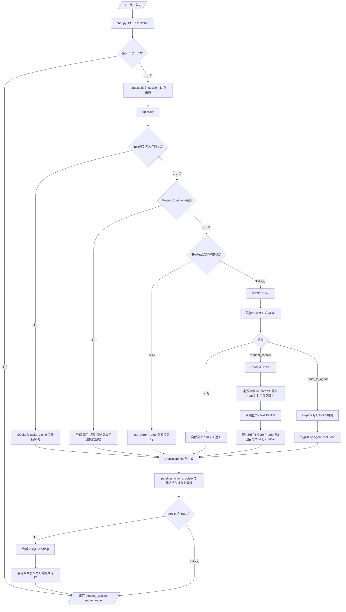

`backend/chat.py` が `/api/chat`、Agent実行、observability、Pending Action登録、SQLite会話保存、Chroma/Markdown artifact保存を所有します。`backend/main.py` はChat Routerを登録するだけで、会話実装の詳細を持ちません。

PETITの人格と会話原則は `petit_prompt.py` のCore Promptを正とします。Tool不要の雑談・相談・説明・文章作成は最初の1 LLM Callで終了します。Broker対応sourceのReadだけ不足する会話は `Brain -> Context Broker -> Brain` の原則2 Callで完了し、書き込みや対象外・複雑処理は既存Deep Agentへ進みます。

---

## 2. PETIT Brain / Context Broker

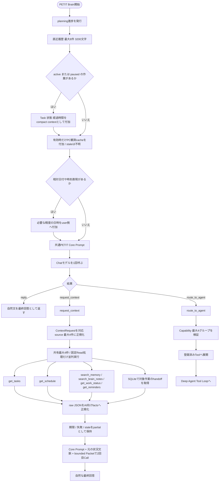

日時はsystem promptへ毎ターン結合せず、相対日付・相対時刻があるターンだけuser側へ注入します。active / pausedのWork Sessionがある場合だけ、小さいuser contextをConversation Entryへ付加します。

Context Brokerは `tasks` / `calendar` / `memory` / `brain` / `work` / `reminders` / `handoff` に対応します。Brokerは具体Tool名をLLMへ大量公開せず、固定したRead処理へ変換し、Toolのriskも実行直前に検証します。独立sourceは最大4件を並列取得し、各source約2500文字のfacts、記録時刻、鮮度、切詰めの有無を返します。詳細なsource対応表は [jarvis-agent.md](jarvis-agent.md) を参照。

`PETIT_CONTEXT_BROKER_TIMEOUT_SECONDS`（既定10秒）を超えたReadを待ち続けず、取得済みの部分結果を返します。実行中のproviderは強制停止できないため終了まで共有枠を占有し、新規要求は枠がなければ`source_busy`。実行待ちのキューを無制限に積みません。不正応答、providerエラー、staleを0件の成功として扱いません。2回目Callにも入口のactive work等を引き継ぎます。

### Call数の基準

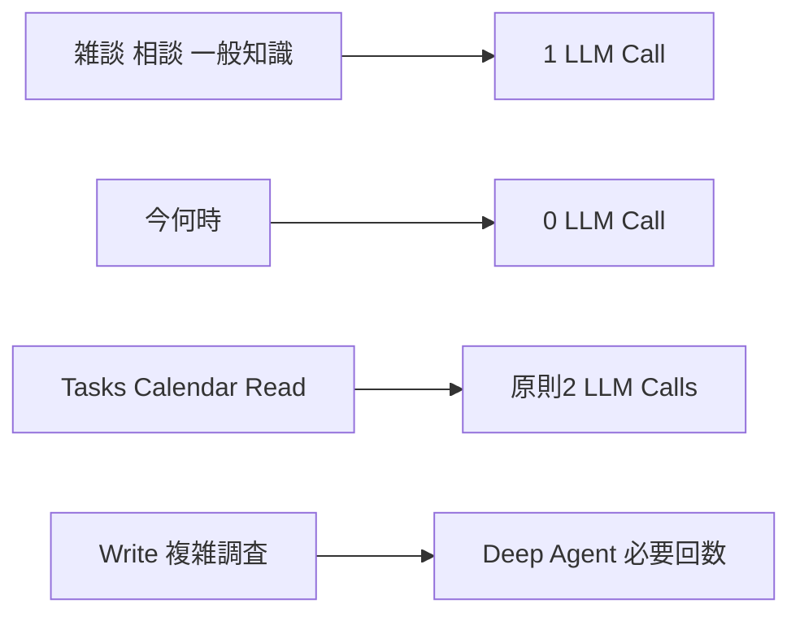

### Capabilityと公開Tool

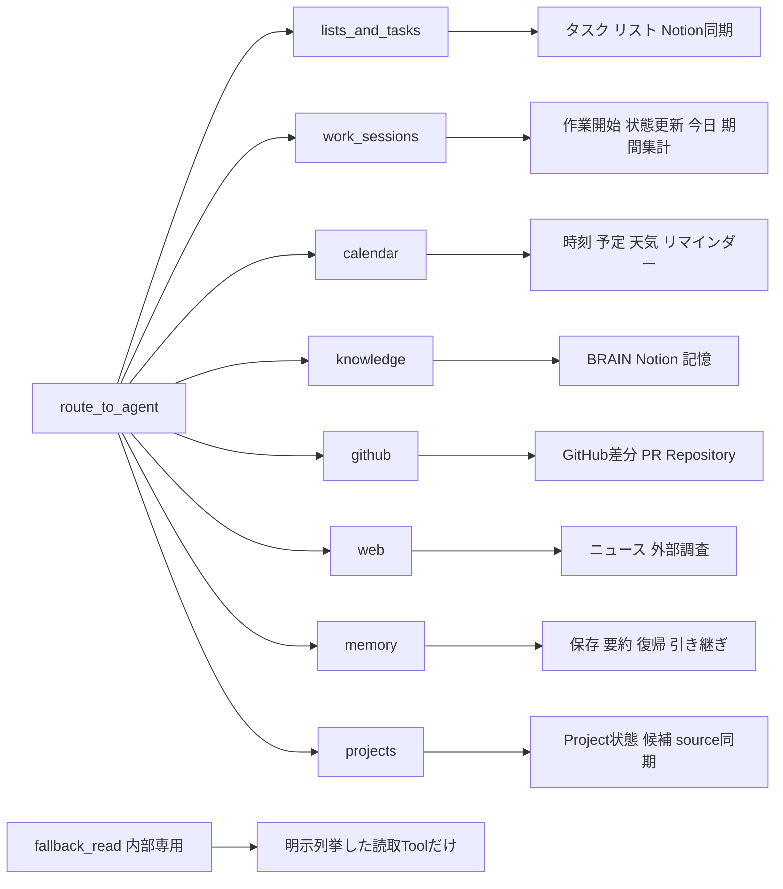

`fallback_read`はSelectorへ公開しない内部グループです。Context Broker対象外の安全なfallbackまたはDeep Agentでだけ使用し、書き込みToolを含めません。

### 作業記録

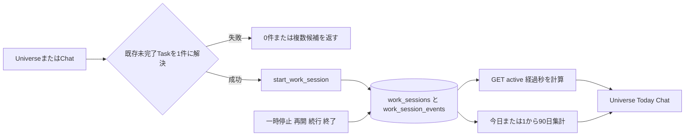

Notion Task DBへ作業時間プロパティは追加しません。SQLiteのセッションへPETIT内部`task_id`を保存し、Notionを含むタスク正本と参照で結びます。開始・一時停止・再開・終了はイベントとして残すため、日付をまたぐ休憩も暦日単位で集計できます。`start_work_session`と`update_work_session`は明示依頼時の低リスク書き込み、`get_work_status`と`get_work_report`は読み取りです。

---

## 3. Agent Tool Loop

```mermaid
flowchart TD
    call[Agentモデルを呼ぶ]
    hasCalls{Tool callがあるか}

    answer[回答本文を取得]
    empty{回答が空か}
    fallbackAnswer[言い換えを求める固定文]
    incomplete{作業予告またはRuntime外の確認だけか}
    retryUsed{再実行済みか}
    forceTool[このターンでTool callするよう再指示]
    deferredFail[未実行を明示した失敗回答]
    finalizing[finalizing進捗を発行]
    final[/最終回答/]

    roundLimit{Toolラウンド上限か}
    stopRound[tool_iteration_limitで停止]
    normalize[Tool callsを正規化]
    each[各Tool callを処理]
    totalLimit{Tool総数6回に到達か}
    stopTotal[tool_call_limitで停止]
    allowed{公開済みToolか}
    notAllowed[tool_not_allowed結果]
    args{引数検証に成功したか}
    badArgs[invalid_tool_arguments結果]
    duplicate{同じToolと引数を実行済みか}
    duplicateStop[duplicate_tool_call結果]
    confirmation{確認が必要か}
    writeFlow[確認付き書き込みフロー]
    execute[Toolをdispatch]
    progressStart[tool_started進捗]
    progressFinish[tool_finished進捗]
    compact[結果を最大20項目 5000文字へ圧縮]
    append[元の依頼とTool結果をmessagesへ追加]

    call --> hasCalls
    hasCalls -->|いいえ| answer --> empty
    empty -->|はい| fallbackAnswer --> incomplete
    empty -->|いいえ| incomplete
    incomplete -->|いいえ| finalizing --> final
    incomplete -->|はい| retryUsed
    retryUsed -->|いいえ| forceTool --> call
    retryUsed -->|はい| deferredFail --> finalizing

    hasCalls -->|はい| roundLimit
    roundLimit -->|はい| stopRound --> final
    roundLimit -->|いいえ| normalize --> each --> totalLimit
    totalLimit -->|はい| stopTotal --> final
    totalLimit -->|いいえ| allowed
    allowed -->|いいえ| notAllowed --> compact
    allowed -->|はい| args
    args -->|いいえ| badArgs --> compact
    args -->|はい| duplicate
    duplicate -->|はい| duplicateStop --> compact
    duplicate -->|いいえ| confirmation
    confirmation -->|はい| writeFlow
    confirmation -->|いいえ| progressStart --> execute --> progressFinish --> compact
    compact --> append --> call
```

親子関係の変更は`set_task_parent`へ集約します。タスク名変更も同時に必要な場合は、同じTool callの`title`へ含め、Runtimeの確認を1回だけ表示します。

Agentの出力もPETIT Core Promptを共有し、Toolあり/なしで人格を切り替えません。

---

## 4. Tool Registryとリスク判定

```mermaid
flowchart TD
    decorator[@tool decorator]
    riskInput{riskが明示されているか}
    explicit[指定riskを使用]
    override{既定risk一覧にあるか}
    defaultRisk[既定riskを使用]
    legacy{requires_confirmationがtrueか}
    confirm[confirm_write]
    safe[safe_read]
    register[Registryへ登録]

    invoke[AgentがToolを選択]
    parse[引数JSONをdictへ]
    writeRisk{confirm_write または destructiveか}
    schema[properties required type enumを検証]
    valid{schemaに適合するか}
    invalid[[error]またはinvalid_tool_arguments]
    dispatch[handlerを実行]
    error{例外や実行時エラーか}
    errorText[[error]文字列]
    result[JSONまたは文字列]

    decorator --> riskInput
    riskInput -->|はい| explicit --> register
    riskInput -->|いいえ| override
    override -->|はい| defaultRisk --> register
    override -->|いいえ| legacy
    legacy -->|はい| confirm --> register
    legacy -->|いいえ| safe --> register

    invoke --> parse --> writeRisk
    writeRisk -->|はい| schema --> valid
    valid -->|いいえ| invalid
    valid -->|はい| dispatch
    writeRisk -->|いいえ| dispatch
    dispatch --> error
    error -->|はい| errorText
    error -->|いいえ| result
```

### リスク区分

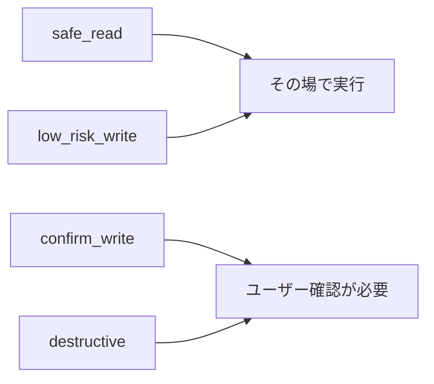

---

## 5. 確認付き書き込みと再開

```mermaid
flowchart TD
    proposal[Agentが確認対象Toolを提案]
    args[Tool schema検証済みの引数]
    saveState[Agent stateをSQLiteへ保存]
    confirmation[Runtimeが確認文とexecute_agent_writeを1回だけ返す]
    register[pending_actions.pyがapproval_idを登録 10分TTL]
    api[POST /api/actions/{approval_id}]
    decision{ユーザーが承認したか}
    cancel[書き込みをキャンセル]
    wrapper[execute_agent_write]
    load{Agent stateが30分以内か}
    expired[期限切れエラー]
    validate{対象Toolが確認対象か}
    invalid[許可されていないTool]
    started[tool_started進捗]
    dispatch[対象Toolをdispatch]
    failed{書き込み成功か}
    failure[tool_finished失敗]
    resume[resume_after_write]
    readOnly[確認不要Toolだけを公開してAgent Loop再開]
    final[自然な最終回答]
    delete[Agent stateを削除]

    proposal --> args --> saveState --> confirmation --> register --> api --> decision
    decision -->|いいえ| cancel
    decision -->|はい| wrapper --> load
    load -->|いいえ| expired
    load -->|はい| validate
    validate -->|いいえ| invalid
    validate -->|はい| started --> dispatch --> failed
    failed -->|いいえ| failure
    failed -->|はい| resume --> readOnly --> final --> delete
```

`pending_actions.py` が短期のapproval状態、10分TTL、承認API、Sona Core互換分岐、承認後のTool dispatchを所有します。`chat.py` はAgent Runtimeが返した`pending_actions`を`pending_actions.register(...)`へ渡し、返された`approval_id`を`ChatResponse`へ載せるだけです。APIモデルは`chat_models.py`で共有し、確認Routerから`main.py`を参照しません。

Agentが自然文だけで「実行しますか？」と返した場合は承認として扱わず、確認対象Toolをcallするよう1回だけ再指示します。

---

## 6. 進捗表示

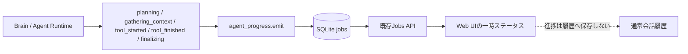

---

## 7. 名前付きタスク完了の決定論的フロー

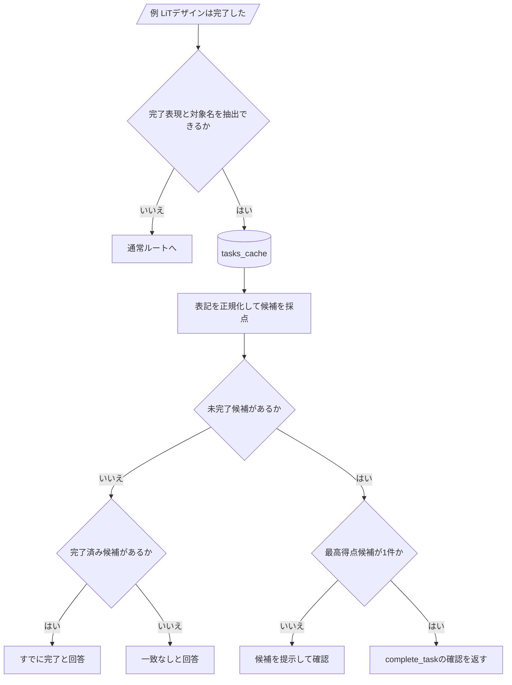

---

## 8. Project Continuityの決定論的フロー


---

## 9. チャットで行えることの全体像

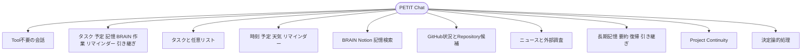

---

## 10. 停止条件と安全境界

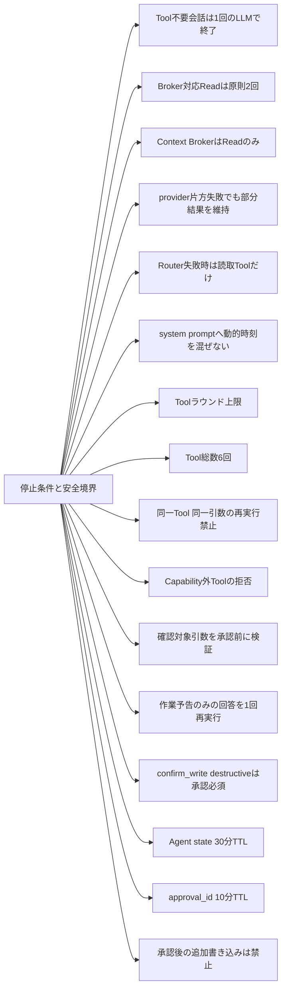

---

## 11. 任意のPC観測

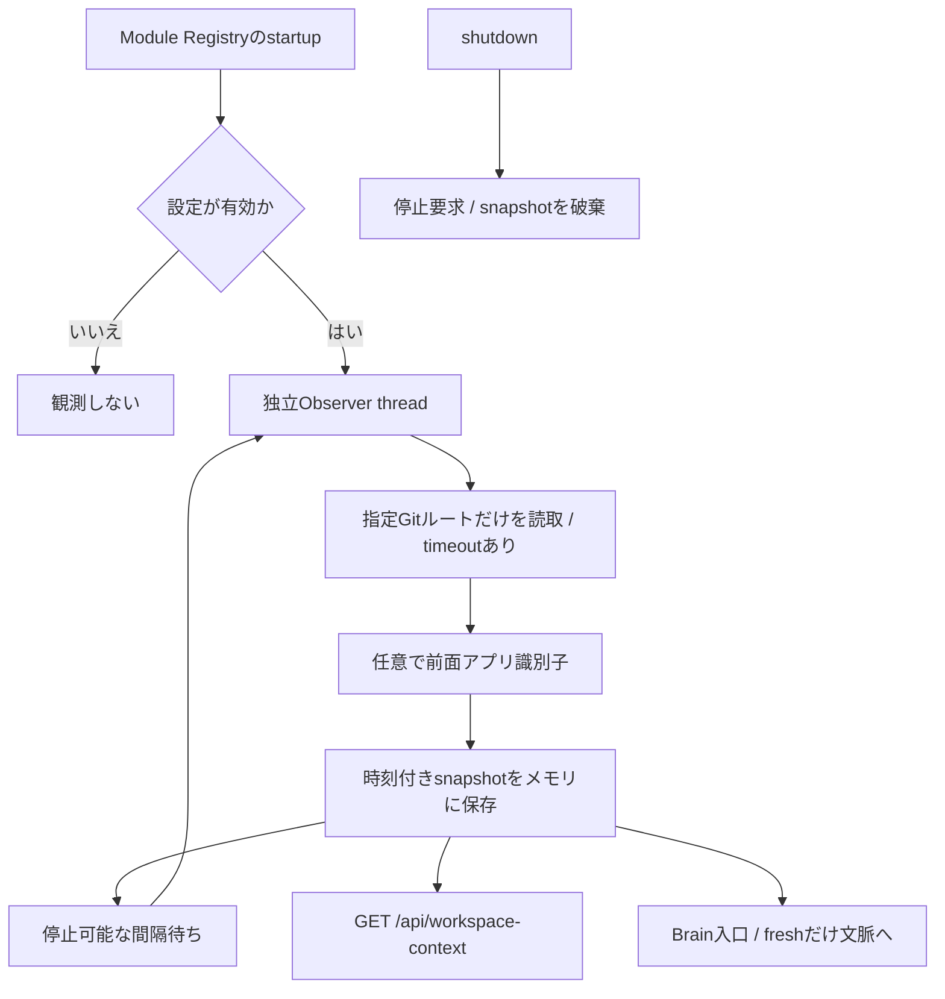

この拡張は既定無効で、Web利用の前提ではありません。サーバーPCだけを観測し、通知・外部操作・任意コード実行へ直接接続しません。

## 保守ルール

以下へ変更を加えた場合は、この文書の対応するMermaid図も同じ変更で更新してください。

- `/api/chat`と確認API
- 決定論的な会話ルート
- PETIT Brain / Context Broker / Capabilityグループ
- Agent Tool Loopと停止条件
- Tool Registryとrisk
- 確認付き書き込みとAgent state再開
- ProgressイベントとUI配信
- Project Continuity

Mermaid図と実装が一致しない状態でmainへ反映しないでください。

## 10. Desktop音声入口（Issue #253）

Desktopは既存の会話・承認・TTSを使用する。iPhone PWA / Vocal Shortcutは従来経路を維持する。
詳細と未確認事項は [desktop.md](desktop.md) を参照。

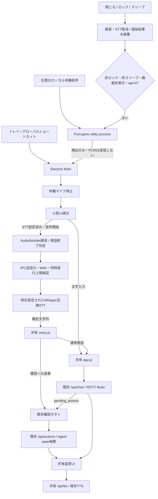
