# PETIT Runtime Flows

この文書は、PETITの会話処理、One-pass Conversation Entry、Capability選択、Tool Calling、確認付き書き込み、進捗表示の実装フローを可視化したものです。

実装の根拠:

- `backend/main.py`
- `backend/agent.py`
- `backend/agent_runtime.py`
- `backend/capability_router.py`
- `backend/situation.py`
- `backend/time_context.py`
- `backend/work_sessions.py`
- `backend/tools/work_sessions.py`
- `backend/tools/registry.py`
- `backend/agent_state.py`
- `backend/agent_progress.py`
- `backend/project_router.py`
- `backend/task_completion_intent.py`

---

## 1. 会話全体フロー

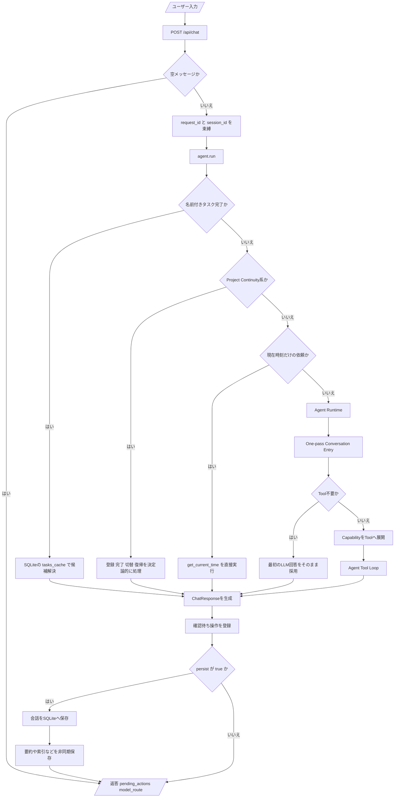

Tool不要の雑談・相談・説明・文章作成は、Conversation Entryの1回目のLLM回答で終了します。個人データ、現在情報、外部ソース、または操作が必要な場合だけAgent Runtimeへ進みます。

---

## 2. One-pass Conversation Entry

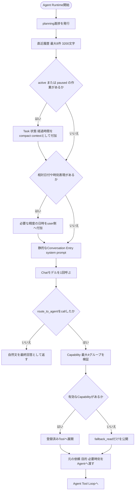

日時はsystem promptへ毎ターン結合せず、相対日付・相対時刻があるターンだけuser側へ注入します。

active / pausedのWork Sessionがある場合だけ、Task名・状態・経過時間・関連IDを小さいuser contextとしてConversation Entryへ付加します。作業がない場合は追加せず、通常質問をWork Session Toolへ強制routeしません。pausedは休憩中として扱います。

- 日付だけ必要: タイムゾーン、日付、曜日
- 時刻も必要: タイムゾーン、分単位の現在日時
- 「今何時？」だけの依頼: LLMを使わず決定論的に処理

### Capabilityと公開Tool

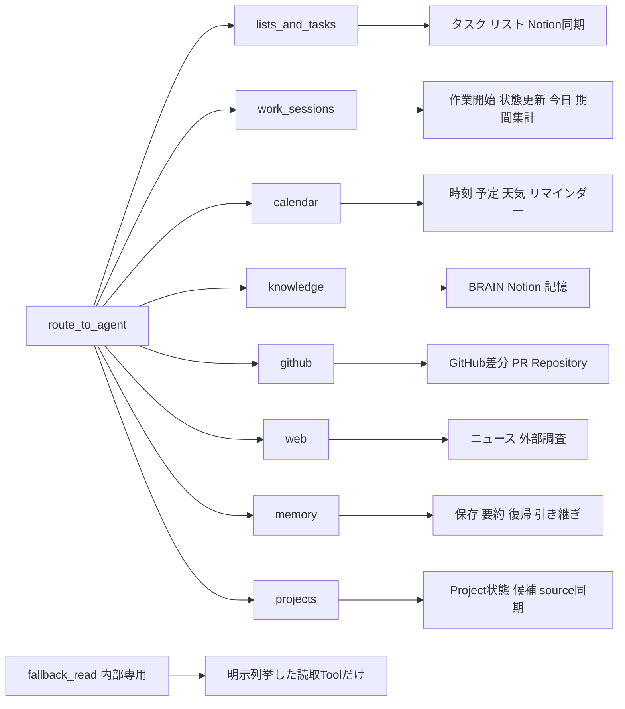

`fallback_read`はSelectorへ公開しない内部グループです。Router出力の欠落、JSON互換出力の失敗、Tool call引数の破損、モデル接続失敗時にだけ使い、書き込みToolを含めません。

### 作業記録

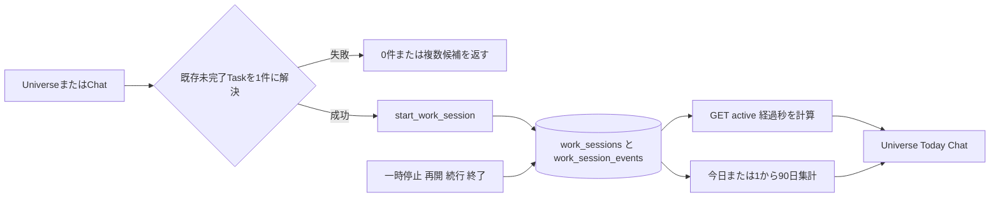

Notion Task DBへ作業時間プロパティは追加しません。SQLiteのセッションへPETIT内部`task_id`を保存し、Notionを含むタスク正本と参照で結びます。開始・一時停止・再開・終了はイベントとして残すため、日付をまたぐ休憩も暦日単位で集計できます。`start_work_session`と`update_work_session`は明示依頼時の低リスク書き込み、`get_work_status`と`get_work_report`は読み取りです。

---

## 3. Agent Tool Loop

```mermaid
flowchart TD
    call[Agentモデルを呼ぶ]
    hasCalls{Tool callがあるか}

    answer[回答本文を取得]
    empty{回答が空か}
    fallbackAnswer[言い換えを求める固定文]
    incomplete{作業予告またはRuntime外の確認だけか}
    retryUsed{再実行済みか}
    forceTool[このターンでTool callするよう再指示]
    deferredFail[未実行を明示した失敗回答]
    finalizing[finalizing進捗を発行]
    final[/最終回答/]

    roundLimit{Toolラウンド上限か}
    stopRound[tool_iteration_limitで停止]
    normalize[Tool callsを正規化]
    each[各Tool callを処理]
    totalLimit{Tool総数6回に到達か}
    stopTotal[tool_call_limitで停止]
    allowed{公開済みToolか}
    notAllowed[tool_not_allowed結果]
    args{引数検証に成功したか}
    badArgs[invalid_tool_arguments結果]
    duplicate{同じToolと引数を実行済みか}
    duplicateStop[duplicate_tool_call結果]
    confirmation{確認が必要か}
    writeFlow[確認付き書き込みフロー]
    execute[Toolをdispatch]
    progressStart[tool_started進捗]
    progressFinish[tool_finished進捗]
    compact[結果を最大20項目 5000文字へ圧縮]
    append[元の依頼とTool結果をmessagesへ追加]

    call --> hasCalls
    hasCalls -->|いいえ| answer --> empty
    empty -->|はい| fallbackAnswer --> incomplete
    empty -->|いいえ| incomplete
    incomplete -->|いいえ| finalizing --> final
    incomplete -->|はい| retryUsed
    retryUsed -->|いいえ| forceTool --> call
    retryUsed -->|はい| deferredFail --> finalizing

    hasCalls -->|はい| roundLimit
    roundLimit -->|はい| stopRound --> final
    roundLimit -->|いいえ| normalize --> each --> totalLimit
    totalLimit -->|はい| stopTotal --> final
    totalLimit -->|いいえ| allowed
    allowed -->|いいえ| notAllowed --> compact
    allowed -->|はい| args
    args -->|いいえ| badArgs --> compact
    args -->|はい| duplicate
    duplicate -->|はい| duplicateStop --> compact
    duplicate -->|いいえ| confirmation
    confirmation -->|はい| writeFlow
    confirmation -->|いいえ| progressStart --> execute --> progressFinish --> compact
    compact --> append --> call
```

親子関係の変更は`set_task_parent`へ集約します。タスク名変更も同時に必要な場合は、同じTool callの`title`へ含め、Runtimeの確認を1回だけ表示します。

Agentの出力は通常プレーンテキストとし、比較・手順・コードなど可読性が明確に上がる場合だけ最小限のMarkdownを許可します。

---

## 4. Tool Registryとリスク判定

```mermaid
flowchart TD
    decorator[@tool decorator]
    riskInput{riskが明示されているか}
    explicit[指定riskを使用]
    override{既定risk一覧にあるか}
    defaultRisk[既定riskを使用]
    legacy{requires_confirmationがtrueか}
    confirm[confirm_write]
    safe[safe_read]
    register[Registryへ登録]

    invoke[AgentがToolを選択]
    parse[引数JSONをdictへ]
    writeRisk{confirm_write または destructiveか}
    schema[properties required type enumを検証]
    valid{schemaに適合するか}
    invalid[[error]またはinvalid_tool_arguments]
    dispatch[handlerを実行]
    error{例外や実行時エラーか}
    errorText[[error]文字列]
    result[JSONまたは文字列]

    decorator --> riskInput
    riskInput -->|はい| explicit --> register
    riskInput -->|いいえ| override
    override -->|はい| defaultRisk --> register
    override -->|いいえ| legacy
    legacy -->|はい| confirm --> register
    legacy -->|いいえ| safe --> register

    invoke --> parse --> writeRisk
    writeRisk -->|はい| schema --> valid
    valid -->|いいえ| invalid
    valid -->|はい| dispatch
    writeRisk -->|いいえ| dispatch
    dispatch --> error
    error -->|はい| errorText
    error -->|いいえ| result
```

### リスク区分

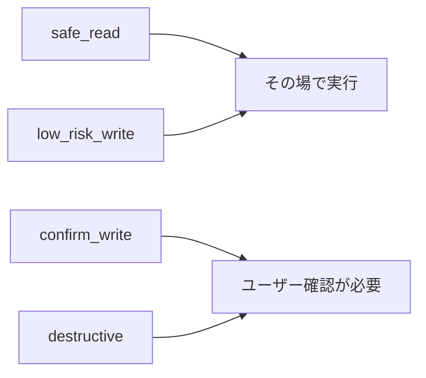

---

## 5. 確認付き書き込みと再開

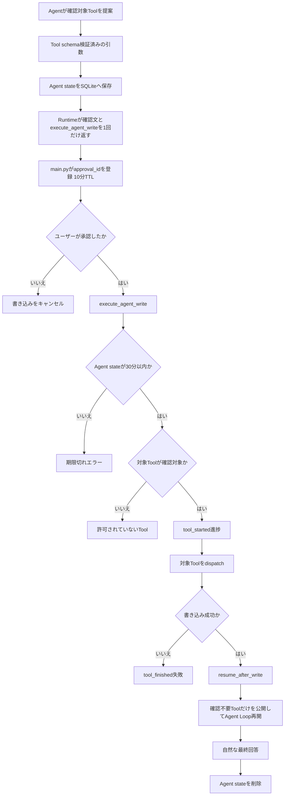

Agentが自然文だけで「実行しますか？」と返した場合は承認として扱わず、確認対象Toolをcallするよう1回だけ再指示します。

---

## 6. 進捗表示

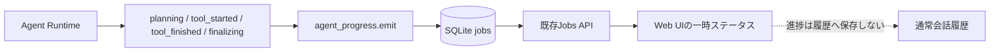

---

## 7. 名前付きタスク完了の決定論的フロー

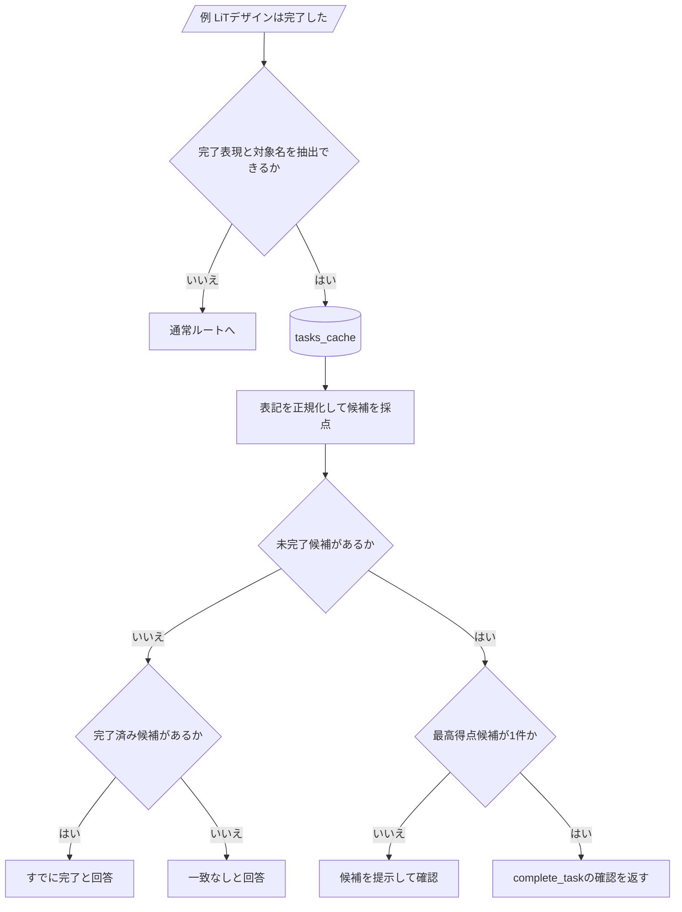

---

## 8. Project Continuityの決定論的フロー

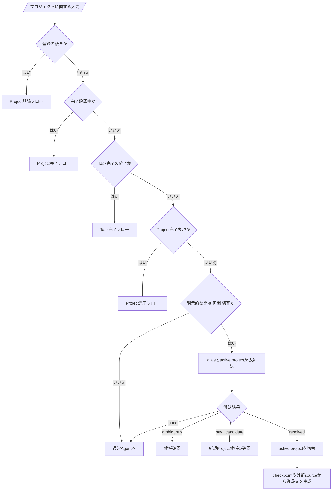

---

## 9. チャットで行えることの全体像

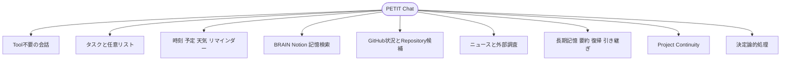

---

## 10. 停止条件と安全境界

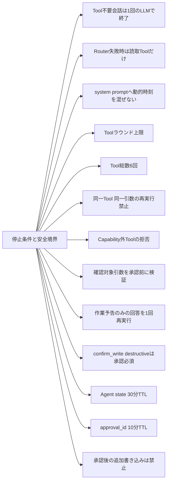

---

## 保守ルール

以下へ変更を加えた場合は、この文書の対応するMermaid図も同じ変更で更新してください。

- `/api/chat`と確認API
- 決定論的な会話ルート
- Conversation EntryとCapabilityグループ
- Agent Tool Loopと停止条件
- Tool Registryとrisk
- 確認付き書き込みとAgent state再開
- ProgressイベントとUI配信
- Project Continuity

Mermaid図と実装が一致しない状態でmainへ反映しないでください。
